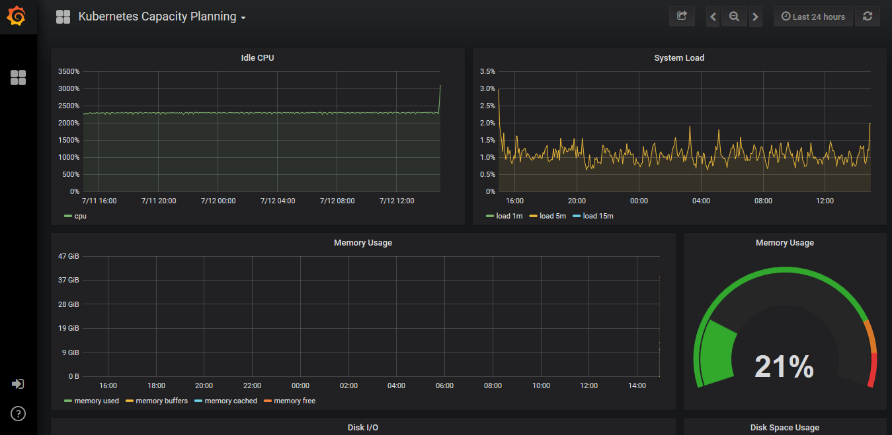
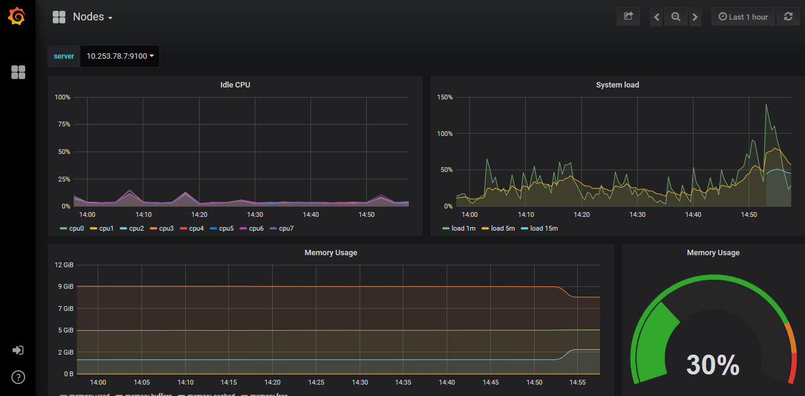
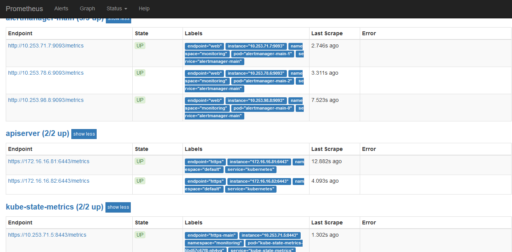

# 部署Prometheus监控

## 参考链接

[prometheus-operator](https://github.com/coreos/prometheus-operator)
[Cluster Monitoring](https://coreos.com/operators/prometheus/docs/latest/user-guides/cluster-monitoring.html)

## 安装Prometheus

```bash
wget https://github.com/coreos/prometheus-operator/archive/v0.19.0.zip
[root@vm01 ~]# unzip v0.19.0.zip
[root@vm01 ~]# cd prometheus-operator-0.19.0/
[root@vm01 prometheus-operator-0.19.0]# cd contrib/kube-prometheus/
[root@vm01 kube-prometheus]# ./hack/cluster-monitoring/deploy
+ manifest_prefix=.
+ kubectl create namespace monitoring
namespace "monitoring" created
+ find ./manifests/prometheus-operator/ -type f '!' -name prometheus-operator-service-monitor.yaml -exec kubectl apply -f '{}' ';'
clusterrolebinding.rbac.authorization.k8s.io "prometheus-operator" created
clusterrole.rbac.authorization.k8s.io "prometheus-operator" created
deployment.apps "prometheus-operator" created
serviceaccount "prometheus-operator" created
service "prometheus-operator" created
+ printf 'Waiting for Operator to register custom resource definitions...'
Waiting for Operator to register custom resource definitions...+ kubectl get customresourcedefinitions servicemonitors.monitoring.coreos.com
+ kubectl get customresourcedefinitions prometheuses.monitoring.coreos.com
+ kubectl get customresourcedefinitions alertmanagers.monitoring.coreos.com
+ kubectl get servicemonitors.monitoring.coreos.com
+ kubectl get prometheuses.monitoring.coreos.com
+ kubectl get alertmanagers.monitoring.coreos.com
+ echo 'done!'
done!
+ kubectl apply -f ./manifests/prometheus-operator/prometheus-operator-service-monitor.yaml
servicemonitor.monitoring.coreos.com "prometheus-operator" created
+ kubectl apply -f ./manifests/node-exporter/
clusterrolebinding.rbac.authorization.k8s.io "node-exporter" created
clusterrole.rbac.authorization.k8s.io "node-exporter" created
daemonset.apps "node-exporter" created
serviceaccount "node-exporter" created
servicemonitor.monitoring.coreos.com "node-exporter" created
service "node-exporter" created
+ kubectl apply -f ./manifests/kube-state-metrics/
Warning: kubectl apply should be used on resource created by either kubectl create --save-config or kubectl apply
clusterrolebinding.rbac.authorization.k8s.io "kube-state-metrics" configured
Warning: kubectl apply should be used on resource created by either kubectl create --save-config or kubectl apply
clusterrole.rbac.authorization.k8s.io "kube-state-metrics" configured
deployment.apps "kube-state-metrics" created
rolebinding.rbac.authorization.k8s.io "kube-state-metrics" created
role.rbac.authorization.k8s.io "kube-state-metrics" created
serviceaccount "kube-state-metrics" created
servicemonitor.monitoring.coreos.com "kube-state-metrics" created
service "kube-state-metrics" created
+ find ./manifests/grafana/ -type f '!' -name grafana-dashboard-definitions.yaml -exec kubectl apply -f '{}' ';'
configmap "grafana-dashboards" created
configmap "grafana-datasources" created
deployment.apps "grafana" created
serviceaccount "grafana" created
service "grafana" created
+ kubectl create -f ./manifests/grafana/grafana-dashboard-definitions.yaml
configmap "grafana-dashboard-definitions" created
+ kubectl apply -f ./manifests/prometheus-k8s/
clusterrolebinding.rbac.authorization.k8s.io "prometheus-k8s" created
clusterrole.rbac.authorization.k8s.io "prometheus-k8s" created
rolebinding.rbac.authorization.k8s.io "prometheus-k8s-config" created
rolebinding.rbac.authorization.k8s.io "prometheus-k8s" created
rolebinding.rbac.authorization.k8s.io "prometheus-k8s" created
rolebinding.rbac.authorization.k8s.io "prometheus-k8s" created
role.rbac.authorization.k8s.io "prometheus-k8s-config" created
role.rbac.authorization.k8s.io "prometheus-k8s" created
role.rbac.authorization.k8s.io "prometheus-k8s" created
role.rbac.authorization.k8s.io "prometheus-k8s" created
configmap "prometheus-k8s-rules" created
serviceaccount "prometheus-k8s" created
servicemonitor.monitoring.coreos.com "kube-apiserver" created
servicemonitor.monitoring.coreos.com "coredns" created
servicemonitor.monitoring.coreos.com "kube-controller-manager" created
servicemonitor.monitoring.coreos.com "kube-scheduler" created
servicemonitor.monitoring.coreos.com "kubelet" created
servicemonitor.monitoring.coreos.com "prometheus" created
service "prometheus-k8s" created
prometheus.monitoring.coreos.com "k8s" created
+ kubectl apply -f ./manifests/alertmanager-main/
secret "alertmanager-main" created
serviceaccount "alertmanager-main" created
servicemonitor.monitoring.coreos.com "alertmanager" created
service "alertmanager-main" created
alertmanager.monitoring.coreos.com "main" created
```

## 配置ingress规则

```bash
[root@vm01 ~]# htpasswd -c ./auth admin
New password:
Re-type new password:
Adding password for user admin
[root@vm01 ~]# cat auth
admin:$apr1$5P4Igh/a$qwVgD2nP9cOsSSissO4Sa0
[root@vm01 ~]# kubectl create secret generic traefik-admin --from-file auth --namespace=monitoring
secret "traefik-admin" created
```

```bash
[root@vm01 ~]# vi prometheus-ingress.yaml
apiVersion: extensions/v1beta1
kind: Ingress
metadata:
  name: prometheus-ingress
  namespace: monitoring
  annotations:
    kubernetes.io/ingress.class: traefik
    ingress.kubernetes.io/auth-type: "basic"
    ingress.kubernetes.io/auth-secret: "traefik-admin"
spec:
  rules:
  - host: grafana.k8s.local
    http:
      paths:
      - path: /
        backend:
          serviceName: grafana
          servicePort: 3000
  - host: prom.k8s.local
    http:
      paths:
      - path: /
        backend:
          serviceName: prometheus-k8s
          servicePort: 9090
  - host: alert.k8s.local
    http:
      paths:
      - path: /
        backend:
          serviceName: alertmanager-main
          servicePort: 9093

[root@vm01 ~]# kubectl create -f prometheus-ingress.yaml
ingress.extensions "prometheus-ingress" created
```

## 配置客户端

```bash
172.16.16.81    grafana.k8s.local
172.16.16.81    prom.k8s.local
172.16.16.81    alert.k8s.local
```

## 访问prometheus和grafana

浏览器输入`grafana.k8s.local`访问grafana：




浏览器输入`prom.k8s.local`访问prometheus webui：

